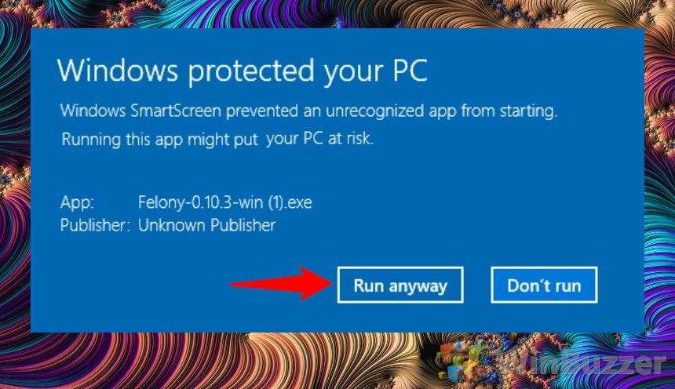

# Install

Seamless Coop is the launch path. It is tested with more than one Archipelago slot in the same session. A player who is not on the Archipelago server can still join and help a slot.

1. Install Seamless Coop for Nightreign and me3.
2. Run `NightreignArchipelago.msi`. The default folder is `C:/NRAP` and can be changed. Windows SmartScreen will say the publisher is unknown because the installer is unsigned. Click **More info**, then **Run anyway**.

The first screen only shows Don't run. More info reveals the app name and Run anyway. Only do this for the MSI downloaded from the GitHub release.

3. Open `nrap-host.exe`. Check the NRAP DLL, regulation folder, and Seamless DLL. Launch writes `nightreign-ap.me3` into the me3 profiles folder.
4. Copy `nightreign.apworld` to `C:/ProgramData/Archipelago/custom_worlds/` and the player yaml into the Archipelago Players folder.
5. Generate, host, then launch with me3. Do not also run `nrsc_launcher.exe`.
6. Expect `NRAP attached 0.5.0` and `NRAP AP connected`.

`flags.toml` host is `host:port` with no scheme. `archipelago.gg` is connected with `wss`. Localhost stays `ws`.

The regulation override hides shop rows and locks Nightfarers and expeditions until a grant. Open the board only after the unlock cache is armed.
